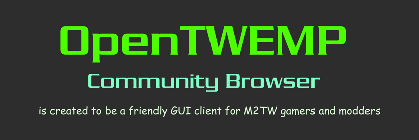

# :globe_with_meridians: OpenTWEMP Community Browser

## :sound: Welcome to OpenTWEMP Community Browser

The **OpenTWEMP Community Browser** repository is a solution to create an feature-powered, super-customizable and user-friendly universal launcher application for [Medieval II Total War](https://store.steampowered.com/app/4700/Total_War_MEDIEVAL_II__Definitive_Edition/) modifications to provide excellent desktop mod management experience.

You can look at this application in action on its official YouTube channel:

:tv: [OpenTWEMP Community Browser Preview 2023.2 Release Demo](https://www.youtube.com/playlist?list=PLLgpEiC0ZVBEgV6UofrRX5WsL9M--PAkO)

---

## :fire: Current Development - [Beta 2024 Release](https://github.com/users/dar920910/projects/15/views/2)

The current development is on the **twemp-2024** branch.

The following child branches reflect independent activities of this release:

### :small_blue_diamond: beta-announces

This branch has to allow only commits related with preparation of planned release announces.

### :small_blue_diamond: beta-browser-core

This branch has to allow only commits related with development of browser's core features:

* TWEMP.Browser.Core.CommonLibrary
* TWEMP.Browser.QA.Benchmarking
* TWEMP.Browser.QA.UnitTesting

### :small_blue_diamond: beta-game-support

This branch has to allow only commits related with the M2TW game support implementation:

* TWEMP.Browser.Core.GamingSupport

### :small_blue_diamond: beta-mods-presets

This branch has to allow only commits related with preparation of presets for M2TW modifications.

### :small_blue_diamond: beta-gui-classic

This branch has to allow only commits related with improving the classic GUI of the browser:

* TWEMP.Browser.App.Classic.CommonLibrary
* TWEMP.Browser.App.Classic.WinForms

### :small_blue_diamond: challenge-gui-modern

This branch has to allow only commits related with experimental implementation of modern cross-platform GUI for the browser.

This challenge encourages to try a new GUI framework (Avalonia/Uno/MAUI) as a replacement for the classic Windows Forms GUI.

### :small_blue_diamond: challenge-database

This branch has to allow only commits related with experimental implementation of the local SQLite database:

* TWEMP.Browser.Core.DataContext
* TWEMP.Browser.Core.EntityModels

### :small_blue_diamond: challenge-worker

This branch has to allow only commits related with experimental implementation of the local worker service:

* TWEMP.Browser.App.WorkerService

### :small_blue_diamond: sandbox

This branch has to allow only commits related with experiments of any ideas beyound project's code base:

* TWE-Testing-Sandbox

### :small_blue_diamond: automation

This branch has to allow only commits related with creation of automation for the project.

These activities are GitHub Actions, configuration files, utilities, scripts and etc.

---

## :hammer: Last Releases

The following releases are versions of the project in phases of **Public Alpha (Preview)** versions.

### Preview 2023.3

The **Preview 2023.3** version is the result of migration the project to **.NET 7** platform.

* **Release:** :link: [OpenTWEMP Community Browser - Preview 2023.3](https://github.com/dar920910/OpenTWEMP-Community-Browser/releases/tag/preview_2023_3)
* **Commit:** [1021e57f3e5a2ee94ca7eb09f10f14c5f1769120](https://github.com/dar920910/OpenTWEMP-Community-Browser/commit/37d4f11074b59fc27e0ee6f040415652b9ac772c)

### Preview 2023.2

* **Release:** :link: [OpenTWEMP Community Browser - Preview 2023.2](https://github.com/dar920910/OpenTWEMP-Community-Browser/releases/tag/preview_2023_2)
* **Commit:** [1021e57f3e5a2ee94ca7eb09f10f14c5f1769120](https://github.com/dar920910/OpenTWEMP-Community-Browser/tree/1021e57f3e5a2ee94ca7eb09f10f14c5f1769120)

### Preview 2023.1

* **Release:** :link: [OpenTWEMP Community Browser - Preview 2023.1](https://github.com/dar920910/OpenTWEMP-Community-Browser/releases/tag/preview_2023_1)
* **Commit:** [5bb2e93b54334d4999595b12a52e2beca117fb8a](https://github.com/dar920910/OpenTWEMP-Community-Browser/tree/5bb2e93b54334d4999595b12a52e2beca117fb8a)

---
